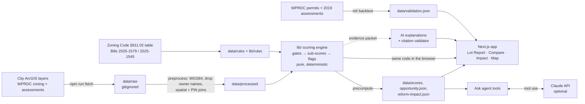

# BuildReady PGH

**Live demo:** _URL added after deploy (see `SUBMISSION.md`)_ · AI for Housing Hackathon (AI Horizons Pittsburgh), Track 1: Development Feasibility & Pro Forma Navigator

> BuildReady PGH shows developers what's blocking a site, shows nonprofits which vacant lots to build on first, and shows the city how many homes its zoning reforms unlock, with every number sourced.

> **Decision support only. Not legal, financial, or zoning advice.** Zoning determinations come from the City Zoning Administrator or Zoning Board of Adjustment.

## What it does and who it is for

One rule-based scoring engine (`lib/`, pure TypeScript, no LLM) with four surfaces:

| Surface | For | What you get |
|---|---|---|
| **Lot Report + Site X-ray** (`/parcel/[id]`) | Small developers, CDCs | Development Ease Score (0-100), five sub-scores, flag cards with a source link and "Confirm with: <office>", numbered map pins where hazards overlap the lot, a **Reform toggle** (current code vs. proposed Bill 2025-1545), editable weights, one-page site memo (print to PDF) |
| **Reform Impact** (`/impact`) | City Planning, Council | How many lots no longer need a lot-size variance (Bill 2025-1579, in effect) and how many could gain by-right ADUs (Bill 2025-1545, **proposed**), by neighborhood, plus a validation backtest |
| **Opportunity Map** (`/map`) | Nonprofits, Land Bank, URA | 13,211 vacant publicly owned lots colored by score, with filters (owner, neighborhood, score, starter-home ready, ADU ready under reform) and a "combine with adjacent lot" badge for undersized lots |
| **Ask panel** (`/map`) | Everyone | A tool-using agent over the engine: it can search, score and explain lots but never sets a score or states a fact that is not in a tool result |

**Integrity principle:** the engine produces every score and fact; AI only explains and orchestrates. Unknown data is shown as *unverified*, never as a pass. Owner names are never stored: only owner *type*.

## Quickstart

Requires Node 20+ (Python 3.11+ only for the validation backtest).

```bash
npm install
# Data (public sources, no API keys). Raw files are gitignored (~550 MB):
npm run fetch          # ~3 min: city ArcGIS layers, WPRDC zoning + assessments
npm run preprocess     # ~40 s: reproject to WGS84, drop owner names, join, zoning spatial join
npm run precompute     # ~17 min on 8 cores: scores for vacant + publicly owned lots (committed output in data/scores)
npm run build-layers   # simplified map layers -> public/layers

npm run dev            # http://localhost:3000   (the web app reads the precomputed JSON only)
npm test               # 25 tests incl. 5 golden parcels
npm run score 0175G00210000000                 # CLI, any parcel in the city
npm run score "5925 Walnut St" -- --reform
npm run reform-impact
```

The committed `data/scores`, `data/opportunity.json` and `data/reform-impact.json` mean the web app runs without re-fetching anything.

Optional AI (needs `ANTHROPIC_API_KEY` in `.env.local`, see `env.example`; never committed):

```bash
npm run ai-explain -- --limit=50   # plain-English flag explanations -> data/ai-cache (validator drops any sentence without a valid [fact-id])
npm run ask-cache                  # regenerate the cached showcase answers
```
Without a key everything still works: flag cards show the engine's own text and the Ask panel uses an engine-only router (clearly labeled).

## Architecture



## Scoring method

Gates first, then five weighted sub-scores (weights editable in the app and in `lib/config.ts`):

* **G1** outside City limits → no score · **G2** non-residential land use with no residential potential → no score · **G3** housing not permitted in the base zoning district → score capped at 40 (flag "use variance or rezoning needed", confirm with the Zoning Board of Adjustment; exception-only districts cap at 70).
* **Zoning fit (40):** lot area vs. district minimum (Pittsburgh Zoning Code §903.03 as amended by **Bill 2025-1579**, in effect May 7, 2025: VL 6,000 · L 3,000 · M 2,400 · H 1,200 · VH none sq ft; no per-unit minimum), use table §911.02, historic district, inclusionary overlay (§907.04.A). Undersized lots get "variance likely, or combine with adjacent lot".
* **Environmental (20):** overlap with slope 25%+, landslide-prone, undermined, FEMA flood zone (Turf polygon intersection; pin at the overlap). Slope and landslide flags say "geotechnical review (Code Ch. 915)".
* **Funding fit (15):** vacant infill in a low-value neighborhood is positive ("eligible for infill/blight scoring (PHFA)"); low values add "gap financing likely" as a note, not a penalty.
* **Access (15):** inside the 1,500 ft major transit buffer = full points.
* **Site & title (10):** vacancy; City/URA/HACP ownership eases acquisition.
* **Water/sewer** is never scored: always the flag "unknown: request PWSA availability letter".
* **Reform rule set** (`lib/rules/reform-2025-1545.ts`, labeled **PROPOSED**; Legistar status "Held In Council", public hearing 9/23/2026, not signed): up to 2 ADUs by right (≤1,000 sq ft, ≤30 ft, no owner-occupancy), no off-street parking minimums, optional Affordable Housing Bonus outside the IZ overlay.

Every fact has the shape `{id, label, value, source, sourceUrl, retrievedAt, confidence, reviewBy}`. See `STATUS.md` for every modeling decision.

## Data sources

Full list with URLs, retrieval dates and licenses: [`data/SOURCES.md`](data/SOURCES.md).

| Data | Source | License / terms |
|---|---|---|
| Parcels (ParcelsPublic), city limits, hazard and overlay layers (slope 25%, landslide, undermined, FEMA 2014, historic districts, inclusionary overlay, parking reduction, major transit buffer), addresses | City of Pittsburgh ArcGIS services | Service metadata states no license; confirm reuse terms with the City |
| Base zoning districts | WPRDC "zoning" (mirror of the city layer) | WPRDC: license not specified |
| Property assessments (values, sales; owner names dropped) | WPRDC / Allegheny County | CC0 |
| Building permits (validation only; owner and contractor names dropped) | WPRDC PLI permits | CC BY (Data Use Agreement applies; attribution: City of Pittsburgh Dept. of Permits, Licenses and Inspections via WPRDC) |
| 2019 property assessments (validation only) | WPRDC "Selected 2019 Property Assessments Files" | CC0 |
| Use table, lot minimums, reform text | Pittsburgh Zoning Code §911.02 / §903.03, Council files 2024-0701, 2025-1579, 2025-1545 (Legistar) | Public record |

## Libraries, datasets and AI tools (disclosure)

* **Libraries:** Next.js 16, React 19, Tailwind CSS 4, TypeScript, Turf.js 7, zod 4, MapLibre GL JS (basemap tiles: CARTO Dark Matter / © OpenStreetMap contributors, no key), tsx, vitest; Python: pandas, numpy, scikit-learn (pinned in `ml/requirements.txt`).
* **AI tools:** **Claude Code** (Anthropic) wrote most of this code during the event. The **Claude API** powers (a) the optional plain-English flag explanations and (b) the Ask agent's tool-use loop. Both are optional at runtime and guarded: explanations pass a citation validator, the agent may only cite tool results, and all scores come from the deterministic engine. If no API key is configured the app falls back to engine text and an engine-only router (labeled in the UI).
* **Event rules:** all code written after Sat Sep 26, 2026 9 AM ET; no keys or secrets in the repo (`.env*` is gitignored).

## Validation ("How we know")

`ml/results.md` and `/impact`: we scored parcels that were vacant in an Aug-2019 assessment snapshot (using 2019 inputs, not today's data, which leaks the answer) and checked how often each score band later got a residential new-construction permit. _Past building reflects market demand as well as feasibility, so we use it to test our score, not replace it._ See `ml/results.md` for the numbers and caveats.

## Limitations

* City of Pittsburgh only; the other 129 Allegheny County municipalities are not covered.
* Not checked: setbacks, height compliance, building code, historic review outcomes, and water/sewer capacity (a PWSA availability letter is required).
* The reform scenario models Bill 2025-1545 **as proposed**, not final text; the reform counts are upper bounds.
* Public data is provided as-is and may be stale; the tool works from a dated snapshot (2026-09-26).
* The zoning use table was transcribed from a July 2024 print of §911.02 (the live code site blocked automated access) and is **not verified against the live code**; planned-development, special-purpose and public-realm districts have no verified use rules and are treated as unknown.
* The web snapshot covers vacant and publicly owned lots (33,507 parcels) plus demo parcels; any other city parcel can be scored with the CLI.
* The validation backtest reflects market demand, not only feasibility.
* Liens and tax delinquency are not included.
* Decision support only.

## Pilot path

City Planning and the URA triaging public land; CDCs screening Land Bank lots; PHFA applicants pre-checking site readiness. Community ownership through this public repo and dated data-refresh scripts (`npm run fetch && npm run preprocess && npm run precompute`).

## What we'd build next

* A Zoning Board variance predictor from past decisions (currently scattered PDFs).
* Setback and height checks; all 130 Allegheny County municipalities.
* PWSA capacity integration; live-refresh mode against the ArcGIS services.
* Verification of the use table against the live code and the official zoning map.

## Project layout

`lib/` engine, rules, agent tools · `scripts/` fetch, preprocess, precompute, CLI · `app/`, `components/` web app · `data/` sources, rules, precomputed scores · `ml/` validation backtest · `tests/` unit + golden tests · `STATUS.md` build log and decisions.

License: MIT.
